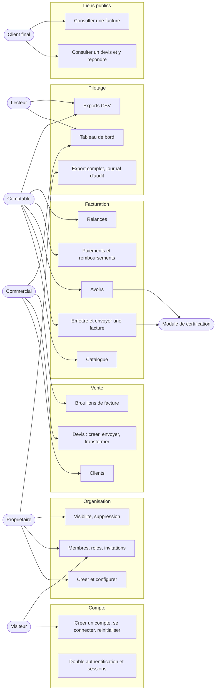
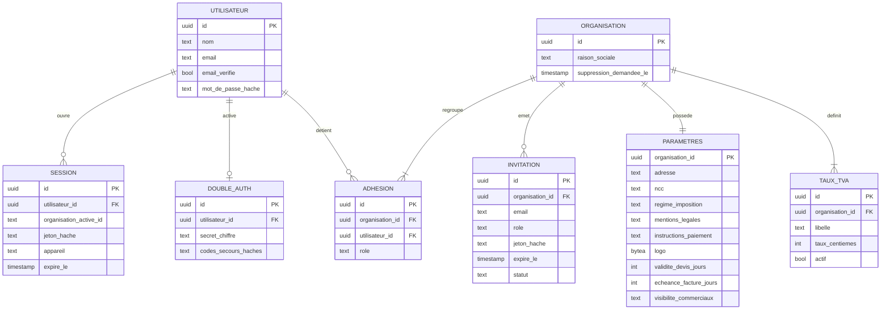
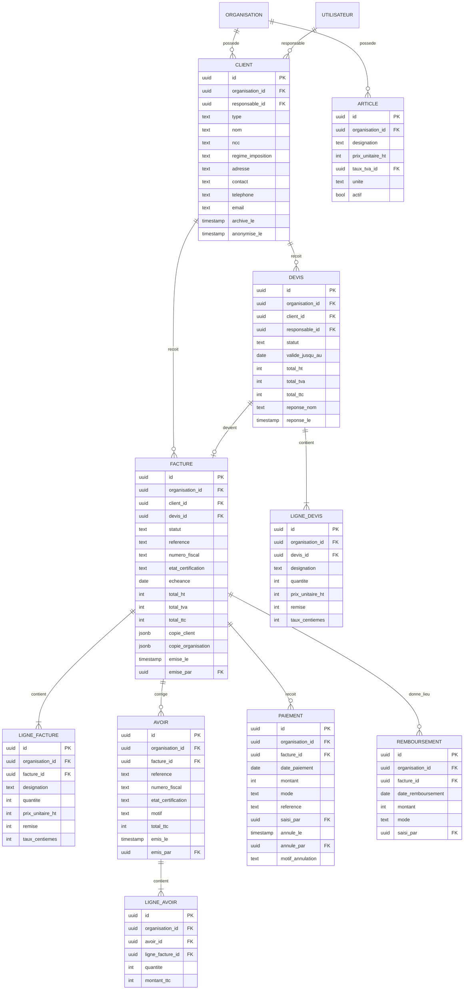
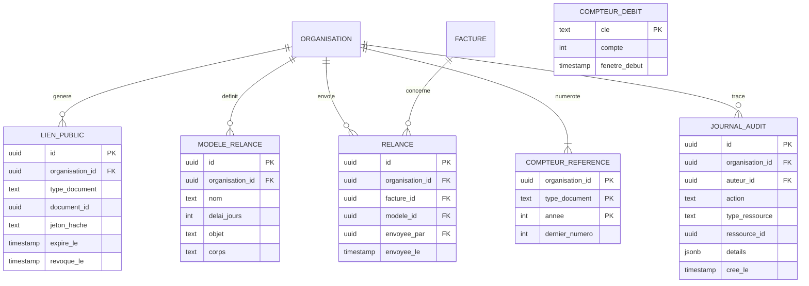
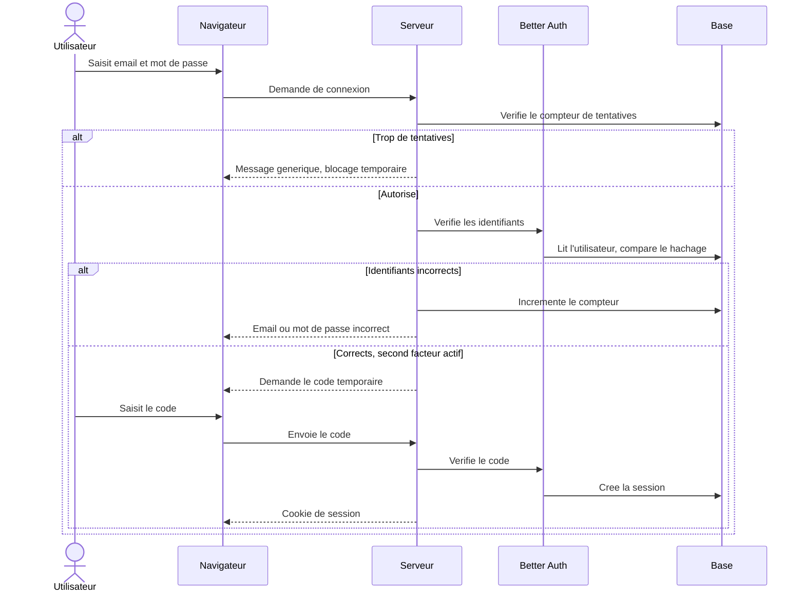
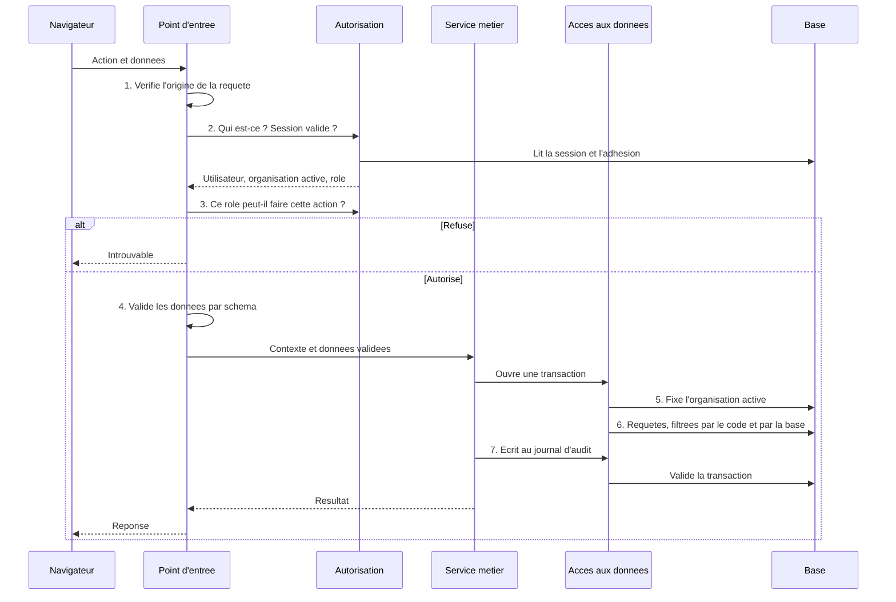
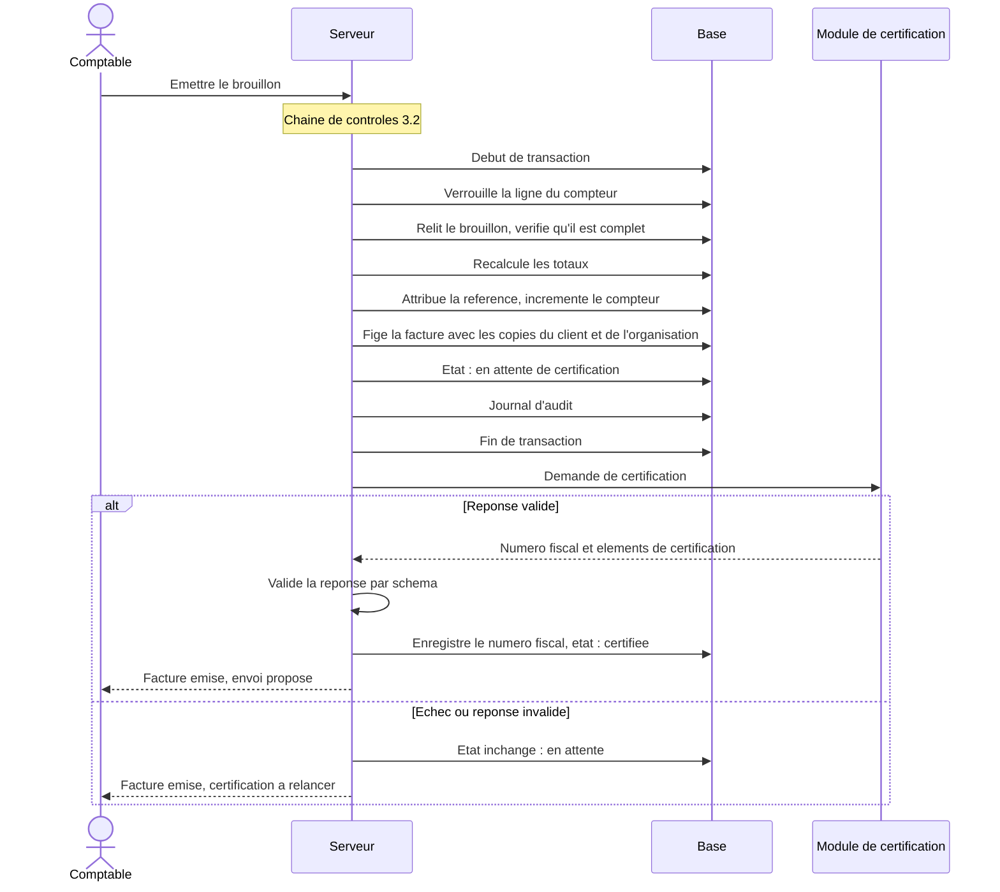
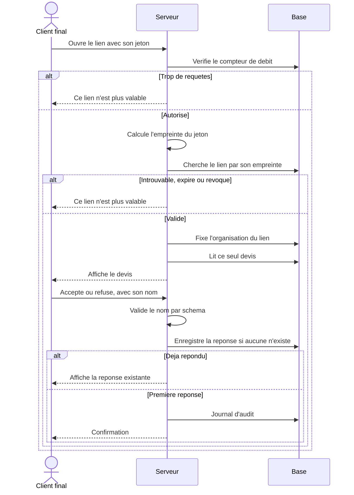
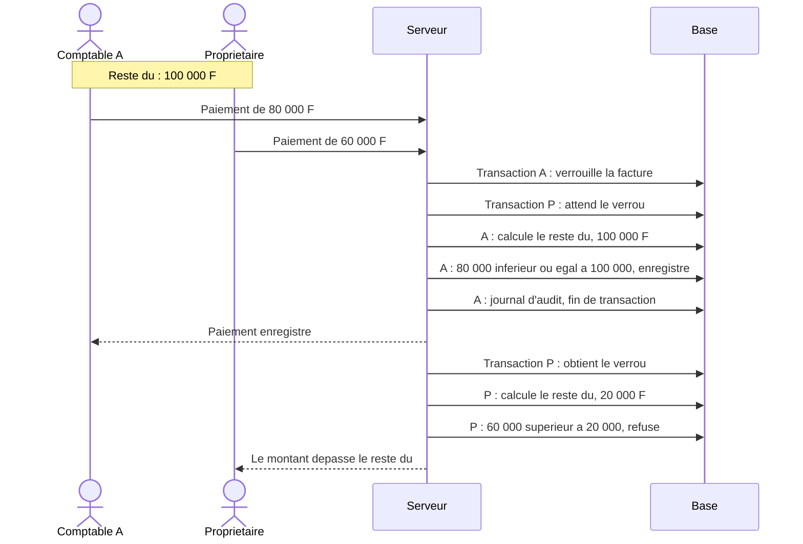
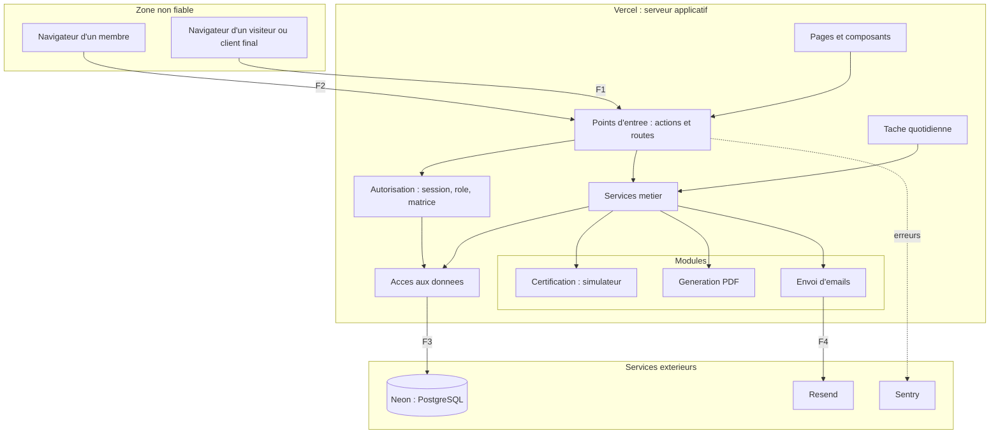

# DESIGN.md — Dossier de conception

Application de facturation pour petites structures.
Statut : **validé**. Version du 5 octobre 2026, mise à jour après la configuration.

## Comment lire ce document

Ce document représente visuellement ce que SPEC.md, USECASES.md et THREATS.md ont décidé. Il contient quatre types de diagrammes, chacun suivi d'un texte qui l'explique.

| Section | Diagramme | Question à laquelle il répond |
|---|---|---|
| 1 | Cas d'utilisation | Qui fait quoi ? |
| 2 | Modèle de données | Quelles tables, quels liens, quelles contraintes ? |
| 3 | Séquences | Dans quel ordre les éléments se parlent-ils ? |
| 4 | Architecture | De quoi le système est-il fait, et où sont les frontières de confiance ? |

Les diagrammes sont écrits en Mermaid. GitHub les affiche directement, et ils se modifient comme du texte.

Les noms de tables et de colonnes sont indicatifs. Dans la base, les tables gérées par Better Auth portent ses propres noms : `user`, `session`, `account`, `verification`, `two_factor`, `organization`, `member`, `invitation`. Leur description exacte est dans `src/server/db/schema/auth.ts`. Dans les diagrammes, UTILISATEUR correspond à `user`, ADHESION à `member`, DOUBLE_AUTH à `two_factor`. L'emplacement de chaque fichier est fixé par STRUCTURE.md.

---

## 1. Cas d'utilisation

### 1.1 Vue d'ensemble

### 1.2 Explication

Les ovales sont les acteurs, les rectangles des groupes de cas d'utilisation, et les cadres les domaines fonctionnels. Une flèche signifie « cet acteur réalise ce cas ».

Trois conventions simplifient la lecture :

- **Les droits s'additionnent de gauche à droite.** Le Comptable fait aussi tout ce que fait le Commercial, et le Propriétaire tout ce que fait le Comptable. Seules les flèches propres à chaque rôle sont tracées. La référence exacte reste la matrice de THREATS.md, section 6.
- **Tout utilisateur connecté** gère son compte (double authentification, sessions), crée une organisation et change d'organisation active. Ces flèches ne sont pas tracées.
- **Le module de certification** n'agit pas de lui-même : il est sollicité par l'émission d'une facture ou d'un avoir.

Ce que le diagramme montre d'un coup d'œil : le cadre « Liens publics » est le seul accessible sans compte, en dehors de l'inscription. C'est la surface d'attaque la plus exposée, et elle ne touche que deux cas d'utilisation.

Le détail des 31 cas figure dans USECASES.md.

---

## 2. Modèle de données

Le modèle est présenté en trois diagrammes pour rester lisible : l'identité, le métier, puis les tables transverses.

**Rappel de lecture.** Chaque boîte est une table. `PK` désigne la clé primaire, qui identifie une ligne. `FK` désigne une clé étrangère, qui pointe vers une autre table. Aux extrémités des traits : deux petits traits pour « exactement un », un rond et une patte d'oie pour « zéro ou plusieurs », un trait et une patte d'oie pour « un ou plusieurs ».

### 2.1 Identité et organisations

**Explication.**

- **UTILISATEUR, SESSION, DOUBLE_AUTH, ORGANISATION, ADHESION et INVITATION** sont créées et gérées par Better Auth. Nous n'écrivons pas leur logique, mais nous devons comprendre leur structure.
- **ADHESION** est la table qui rend possible le compte unique pour plusieurs organisations : une ligne par couple utilisateur et organisation, avec le rôle. C'est elle que le contrôle d'accès consulte à chaque requête.
- **Identifiants.** Better Auth est configuré avec `generateId: "uuid"` : tous les identifiants et toutes les clés étrangères de ses tables sont de type `uuid`, et la base les fabrique par `gen_random_uuid()` (`docs/features/identifiants-uuid.md`).
- **SESSION** porte l'organisation active. Changer d'organisation (UC-11) modifie cette colonne, après vérification de l'adhésion. **Exception acceptée :** `organisation_active_id` reste de type `text`, sans clé étrangère, car le module organisation de Better Auth la déclare ainsi et la configuration ne permet pas d'en changer le type. Elle contient un UUID écrit en texte, validé comme UUID à chaque lecture avant usage.
- **PARAMETRES** regroupe la fiche de l'organisation, ses réglages et son logo. Les instructions de paiement y sont isolées dans une colonne dont la modification suit un chemin de code distinct, avec nouvelle authentification (S-33).
- **TAUX_TVA** stocke le taux en centièmes de pour cent : 1800 pour 18 %. On évite ainsi tout nombre à virgule. Un taux n'est jamais supprimé, seulement désactivé, car d'anciens documents y font référence.
- **Aucun mot de passe, jeton ou code n'est stocké en clair** : uniquement des valeurs hachées ou chiffrées.

### 2.2 Métier

**Explication.**

- **Toute table porte `organisation_id`**, y compris les lignes, les paiements et les avoirs. Cela paraît redondant, puisqu'une ligne appartient à une facture qui appartient à une organisation. C'est voulu : la base peut ainsi filtrer chaque table directement, sans dépendre d'une jointure qu'une requête pourrait oublier (S-04, menace T-30).
- **Devis et factures sont deux tables distinctes**, avec chacune leurs lignes. Leurs cycles de vie et leurs règles diffèrent trop pour partager une table.
- **Les lignes recopient** la désignation, le prix et le taux. Elles ne pointent pas vers l'article du catalogue : modifier le catalogue ne change donc aucun document (R-07).
- **`copie_client` et `copie_organisation`** figent sur la facture les coordonnées du jour de l'émission (R-06). La facture reste exacte même si le client déménage ou est anonymisé.
- **`reference` et `numero_fiscal` sont vides tant que la facture est un brouillon.** La première est attribuée à l'émission (R-03), le second vient du module de certification (R-04).
- **Un paiement n'est jamais supprimé.** Son annulation remplit trois colonnes : la date, l'auteur et le motif (S-31). Un paiement « valide » est un paiement dont `annule_le` est vide.
- **Les totaux sont stockés sur le document.** Pour un brouillon, le serveur les recalcule à chaque enregistrement et ignore ceux reçus du navigateur (T-13). À l'émission, ils sont figés.
- **Le reste dû n'est pas stocké.** Il se calcule : total, moins les avoirs, moins les paiements valides (R-09). Une valeur calculée ne peut pas diverger de ses sources.
- **Les statuts « expiré » et « en retard » ne sont pas stockés non plus.** Ils se déduisent des dates à la lecture.
- **Un client n'est jamais supprimé** : il est archivé ou anonymisé, pour que ses documents restent rattachés.

### 2.3 Tables transverses

**Explication.**

- **LIEN_PUBLIC** ne stocke que l'empreinte du jeton. Le jeton lui-même n'existe que dans l'adresse envoyée au client. Même en cas de fuite de la base, les liens ne sont pas utilisables (S-20).
- **COMPTEUR_REFERENCE** tient le dernier numéro attribué, par organisation, par type de document et par année. C'est la ligne que l'émission verrouille pour garantir une suite sans trou ni doublon (R-03, S-32).
- **JOURNAL_AUDIT** ne reçoit que des ajouts. Le rôle de base de données utilisé par l'application n'a ni le droit de modifier ni celui de supprimer dans cette table (S-70, T-21). Sa colonne `details` ne contient ni secret ni donnée personnelle.
- **COMPTEUR_DEBIT** sert à la limitation de débit. Sa clé combine l'action et l'origine, par exemple « lien public, adresse IP » ou « envoi d'email, organisation ». C'est la seule table sans `organisation_id`, car elle compte aussi des visiteurs anonymes.

### 2.4 Contraintes portées par la base

Une contrainte est une règle que la base fait respecter elle-même. Elle protège même si le code applicatif contient une erreur.

| Table | Contrainte | Règle servie |
|---|---|---|
| Toutes les tables métier | `organisation_id` obligatoire, avec règle de sécurité au niveau des lignes | S-01, S-04 |
| Tables liées | La clé étrangère inclut `organisation_id` : une facture ne peut pointer que vers un client de la même organisation | S-01, T-30 |
| ADHESION | Un seul couple utilisateur et organisation | F-014 |
| CLIENT | Pour une entreprise, le NCC est obligatoire. Pour un particulier, le nom et le téléphone | F-020 |
| FACTURE, AVOIR | `reference` unique par organisation | R-03 |
| FACTURE | Si le statut n'est pas « brouillon », la référence et la date d'émission sont renseignées | R-03 |
| FACTURE, AVOIR, leurs lignes | Un déclencheur refuse toute modification ou suppression d'un document émis | R-05, T-10 |
| Lignes | Quantité strictement positive, prix et remise positifs ou nuls, remise inférieure ou égale au montant de la ligne | R-08 |
| PAIEMENT, REMBOURSEMENT | Montant strictement positif, date non future | F-080 |
| PAIEMENT | Aucune suppression possible. Les colonnes d'annulation se remplissent ensemble ou pas du tout | S-31 |
| JOURNAL_AUDIT | Ajout seul : ni modification ni suppression | S-70 |
| Tous les montants | Type entier | R-01 |
| Suppressions | Aucune suppression en cascade vers un document émis | R-05 |

Deux règles ne peuvent pas s'exprimer par une simple contrainte, car elles portent sur plusieurs lignes : « la somme des paiements et avoirs ne dépasse pas le total » (S-30) et « la numérotation est continue » (S-32). Elles sont garanties par des transactions avec verrou, décrites dans les séquences 3.3 et 3.5.

### 2.5 L'isolation par organisation dans la base

C'est la protection la plus importante du modèle. Elle fonctionne en trois temps.

1. **L'application se connecte à la base avec un rôle restreint.** Ce rôle ne possède pas les tables et ne peut pas contourner les règles de sécurité. Un second rôle, propriétaire des tables, ne sert qu'aux migrations.
2. **Au début de chaque transaction, le serveur indique à la base l'organisation active**, à partir de la session vérifiée. Cette indication ne vaut que pour la transaction en cours.
3. **Chaque table métier a une règle** : une ligne n'est visible et modifiable que si son `organisation_id` est celui indiqué. Sans indication, aucune ligne n'est visible.

Conséquence : si une requête du code oublie son filtre, la base ne renvoie rien d'une autre organisation. Le filtre du code et la règle de la base forment la double barrière de l'exigence S-04.

Trois cas particuliers :

- **Les tables de Better Auth** (utilisateurs, sessions) ne sont pas filtrées par organisation, car un utilisateur n'appartient pas à une seule organisation. Seule la bibliothèque y accède.
- **Les liens publics** sont recherchés par l'empreinte du jeton, avant que l'organisation soit connue. Une fonction dédiée effectue cette seule recherche, puis fixe l'organisation à partir du lien trouvé.
- **La tâche quotidienne** parcourt les organisations une par une, en fixant l'organisation à chaque passage.

---

## 3. Séquences

Un diagramme de séquence se lit de haut en bas. Chaque colonne est un participant. Une flèche pleine est une demande, une flèche pointillée une réponse.

### 3.1 Connexion avec double authentification

**Explication.** La limitation de débit intervient avant toute vérification, pour qu'un attaquant ne puisse pas enchaîner les essais (T-01). Le message d'échec est identique, que l'email existe ou non (T-07). Aucune session n'est créée avant la validation du second facteur : un mot de passe volé seul ne donne accès à rien (T-02). Le cookie de session est inaccessible aux scripts de la page (S-82).

### 3.2 Requête métier : la chaîne de contrôles

**Explication.** C'est le diagramme le plus important du document, car toutes les actions des membres suivent cette chaîne. Les sept étapes numérotées sont les sept contrôles.

1. **Origine.** Une requête venue d'un autre site est refusée (S-81, T-17).
2. **Identité.** La session est relue en base à chaque requête : un membre retiré ou une session révoquée est refusé immédiatement (S-17, T-52).
3. **Autorisation.** Le rôle est comparé à la matrice, qui n'existe qu'à un seul endroit du code (T-50). Un refus répond « introuvable », comme si la ressource n'existait pas (S-02).
4. **Validation.** Les données sont vérifiées par un schéma Zod (S-50).
5. **Contexte.** L'organisation active est transmise à la base.
6. **Double filtre.** Le code filtre par organisation, et la base aussi (S-04).
7. **Trace.** L'écriture au journal fait partie de la même transaction : soit l'action et sa trace réussissent ensemble, soit aucune des deux (S-70).

La règle de construction qui en découle : **aucune action ne peut atteindre le service métier sans passer par les étapes 1 à 4**. Une fonction commune les enchaîne, et chaque action est déclarée à travers elle.

### 3.3 Émission d'une facture

**Explication.** Le verrou sur le compteur garantit que deux émissions simultanées reçoivent deux numéros consécutifs : la seconde attend la fin de la première (S-32, T-15). La référence et le gel de la facture sont dans une seule transaction : il est impossible d'obtenir un numéro sans facture, ou une facture sans numéro.

L'appel au module de certification a lieu **après** la transaction, jamais pendant. Un service extérieur lent ne doit pas bloquer la numérotation de toute l'organisation. Si la certification échoue, la facture existe déjà avec sa référence et reste « en attente » : elle n'est pas envoyée au client et peut être retransmise (F-062). La réponse du module est validée comme n'importe quelle donnée extérieure (S-87, T-18).

### 3.4 Réponse à un devis par lien public

**Explication.** Les trois cas d'échec renvoient exactement la même page : un attaquant ne peut pas distinguer un lien inexistant d'un lien expiré, ni savoir qu'il est limité en débit (S-21, T-32). Le serveur ne compare jamais le jeton lui-même, seulement son empreinte (S-20). L'enregistrement de la réponse se fait par une seule requête conditionnelle, « mettre à jour si aucune réponse n'existe » : deux clics simultanés ne produisent qu'une décision (S-22, T-16). La page n'expose aucun identifiant interne et n'envoie pas son adresse aux sites tiers (S-80, T-37).

### 3.5 Paiements simultanés

**Explication.** Sans verrou, les deux transactions liraient chacune un reste dû de 100 000 F, et la facture recevrait 140 000 F de paiements. Le verrou sur la ligne de la facture oblige la seconde transaction à attendre, puis à recalculer avec le paiement de la première (S-30, T-14). Le même mécanisme protège l'émission des avoirs. Ce scénario fera l'objet d'un test automatisé qui lance réellement deux requêtes en parallèle.

---

## 4. Architecture

### 4.1 Vue d'ensemble

### 4.2 Explication

Le système est fait de trois zones, séparées par les frontières de confiance F1 à F4 définies dans THREATS.md.

**La zone non fiable** contient les navigateurs. Tout ce qui en vient est contrôlé, y compris quand l'utilisateur est connecté.

**Le serveur applicatif** est organisé en couches, chacune ne parlant qu'à la suivante :

| Couche | Rôle | Ce qu'elle n'a pas le droit de faire |
|---|---|---|
| Pages et composants | Afficher, recueillir les saisies | Accéder à la base, décider d'un droit |
| Points d'entrée | Recevoir les requêtes, enchaîner les contrôles de la séquence 3.2 | Contenir des règles métier |
| Autorisation | Identifier l'utilisateur, appliquer la matrice | Être contournée : c'est le seul chemin vers les services |
| Services métier | Appliquer les règles : calculs, cycles de vie, numérotation | Lire une session ou une requête : ils reçoivent un contexte déjà vérifié |
| Accès aux données | Parler à la base, fixer l'organisation active | Être appelé depuis une page |
| Modules | Certifier, générer un PDF, envoyer un email | Accéder à la base directement |

**Les services extérieurs** ne reçoivent que le nécessaire : Neon toutes les données, Resend les destinataires et le contenu des emails, Sentry les erreurs sans donnée personnelle.

### 4.3 Les règles d'architecture

Ces règles seront inscrites dans CLAUDE.md et vérifiées automatiquement.

1. **Un seul dossier importe Drizzle.** Toute requête passe par la couche d'accès aux données (S-86).
2. **Un seul fichier contient la matrice des droits.** Les contrôles et les tests la lisent tous deux (T-50).
3. **Toute action est déclarée à travers la fonction commune** qui enchaîne origine, identité, autorisation et validation.
4. **Un service métier reçoit toujours un contexte** : utilisateur, organisation, rôle. Il ne peut pas être appelé sans.
5. **Les modules sont interchangeables.** La certification, l'envoi d'emails et la génération de PDF sont définis par une interface. Le simulateur de certification et l'intercepteur d'emails en développement en sont des implémentations.
6. **Les schémas de validation sont partagés** entre les formulaires et le serveur, dans un seul dossier (S-50).
7. **Aucun secret n'atteint le navigateur.** Les variables accessibles côté client sont listées explicitement.

### 4.4 Les environnements

| Environnement | Hébergement | Base | Emails | Certification |
|---|---|---|---|---|
| Développement | Poste local | Branche Neon `dev` | Interceptés localement | Simulateur |
| Test automatisé | GitHub Actions | À définir avec la CI | Interceptés | Simulateur |
| Prévisualisation | Vercel, une adresse par PR, protégée par connexion | Branche Neon `preview`, commune aux PR | Interceptés | Simulateur |
| Production | Vercel, région de Francfort | Branche Neon `production` | Service d'envoi, à configurer | Simulateur, avec mention visible |

Chaque environnement a ses propres secrets. Aucun environnement autre que la production n'accède aux données de production (S-83, T-74).

---

## 5. Décisions de conception prises dans ce document

Ces choix techniques n'étaient pas dans les documents précédents. Ils sont expliqués plus haut et ont été validés.

1. **`organisation_id` sur toutes les tables**, y compris les lignes et les paiements, pour que la base filtre chaque table directement.
2. **Totaux stockés et figés à l'émission, reste dû et statuts temporels calculés à la lecture.**
3. **Deux rôles de base de données** : un rôle restreint pour l'application, un rôle propriétaire réservé aux migrations.
4. **Certification appelée après la transaction d'émission**, jamais pendant.
5. **Verrou sur la facture** pour les paiements et les avoirs, et sur le compteur pour la numérotation.
6. **Architecture en couches**, avec une fonction commune obligatoire pour toute action.
