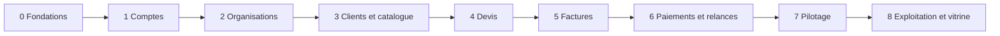

# PLAN.md — Plan de développement et stratégie de tests

Application de facturation pour petites structures.
Statut : **validé**. Version du 7 octobre 2026.

## Comment lire ce document

Ce document découpe le périmètre de SPEC.md en fonctionnalités, fixe l'ordre dans lequel les construire, et définit comment chacune est testée.

- La section 1 pose les principes.
- La section 2 liste les jalons et leurs fonctionnalités.
- La section 3 explique l'ordre retenu.
- La section 4 décrit la stratégie de tests.
- La section 5 dit quand une fonctionnalité est terminée.
- Les sections 6 et 7 donnent une estimation et les risques.

Un **jalon** est un ensemble de fonctionnalités qui, une fois livré, peut être montré à quelqu'un. Une **fonctionnalité** correspond à une fiche dans `docs/features/`, une branche et une pull request.

---

## 1. Principes

1. **Par tranches verticales.** Une fonctionnalité traverse toutes les couches : base, service, action, écran, tests. On ne construit pas « toute la base », puis « tous les écrans ».
2. **Les fondations de sécurité avant le métier.** La chaîne de contrôles, la matrice des droits et le journal d'audit existent avant la première fonctionnalité qui en dépend. Les ajouter après coup obligerait à tout reprendre.
3. **Chaque jalon est déployé.** À la fin d'un jalon, la production contient quelque chose d'utilisable et de démontrable.
4. **Une fonctionnalité, une fiche, une PR.** La fiche est validée avant le code. Les tests sont écrits avant le code.
5. **Rien n'est exposé avant d'être protégé.** Une route n'apparaît qu'avec ses contrôles et ses tests d'attaque.

---

## 2. Jalons et fonctionnalités

Taille : **S** une à deux séances, **M** trois à cinq, **L** six à dix. Une séance représente environ une heure.

### Jalon 0 — Fondations

Aucun écran métier. Ce jalon construit ce dont toutes les fonctionnalités auront besoin.

| # | Fonctionnalité | Contenu | Exigences et menaces | Taille |
|---|---|---|---|---|
| 0.1 | Variables d'environnement | `src/server/env.ts` : lecture et validation au démarrage. Retrait de l'exception ESLint sur `client.ts` | S-83, règle 12 | S |
| 0.2 | Accès aux données | Transaction avec organisation active, modèle de règle de sécurité au niveau des lignes réutilisable, outillage de test avec deux organisations | S-01, S-04, T-30, T-53 | M |
| 0.3 | Journal d'audit | Table en ajout seul, droits retirés au rôle de l'application, fonction d'écriture dans la transaction | S-70, S-71, T-20, T-21 | S |
| 0.4 | Chaîne de contrôles et matrice | Fonction commune des actions : origine, session, rôle, validation. Matrice des droits dans un seul fichier, avec son test exhaustif | S-02, S-03, S-05, S-81, T-17, T-50 | L |
| 0.5 | Limitation de débit | Compteurs en base, fonction réutilisable | S-11, S-22, S-55, S-84, T-40 à T-42 | S |
| 0.6 | Socle d'interface | Gabarits des trois zones, navigation, pages « introuvable » et « erreur », textes, formatage des montants et des dates, en-têtes de sécurité | S-80, S-85, NF-01 à NF-04, T-34, T-35 | M |
| 0.7 | Envoi d'emails | Module interchangeable : interception en local et en test, envoi réel en production par un compte Gmail dédié à l'application. Choix et vérification de la dépendance d'envoi | S-51, S-55 | M |
| 0.8 | Contrôle après déploiement | Vérification automatique que la production utilise le rôle restreint | T-53, T-74 | S |

**Démontrable à la fin :** rien pour un utilisateur. Pour un recruteur : une architecture où aucune action ne peut contourner les contrôles, prouvée par des tests.

### Jalon 1 — Comptes

| # | Fonctionnalité | Cas d'utilisation | Exigences et menaces | Taille |
|---|---|---|---|---|
| 1.1 | Inscription et vérification de l'email | UC-01 | F-001, S-10, S-11, S-15, T-07 | M |
| 1.2 | Connexion et déconnexion | UC-02 | F-002, S-11, S-82, T-01, T-03 | M |
| 1.3 | Réinitialisation du mot de passe | UC-03 | F-002, S-15, S-17, T-04 | M |
| 1.4 | Double authentification et codes de secours | UC-04 | F-003, S-12, S-13, T-02, T-06 | M |
| 1.5 | Sessions actives | UC-05 | F-004, S-17 | S |

**Démontrable à la fin :** un visiteur crée un compte, le vérifie, active la double authentification et gère ses sessions.

### Jalon 2 — Organisations

| # | Fonctionnalité | Cas d'utilisation | Exigences et menaces | Taille |
|---|---|---|---|---|
| 2.1 | Création et changement d'organisation | UC-06, UC-11 | F-010, F-014, S-01 | M |
| 2.2 | Paramètres de l'organisation | UC-07 | F-011, F-057, S-14, S-33, S-53, T-12, T-60 | L |
| 2.3 | Invitations | UC-08, UC-09 | F-012, S-15, S-16, T-05 | M |
| 2.4 | Rôles et retrait d'un membre | UC-10 | F-013, F-017, R-12, S-05, S-17, T-51, T-52, T-54 | M |
| 2.5 | Suppression différée | UC-13 | F-018, R-15, T-44 | S |

**Démontrable à la fin :** un gérant crée son entreprise, invite un comptable et un vendeur, et un comptable externe bascule entre deux entreprises sans jamais voir les données de l'une dans l'autre.

### Jalon 3 — Clients et catalogue

| # | Fonctionnalité | Cas d'utilisation | Exigences et menaces | Taille |
|---|---|---|---|---|
| 3.1 | Clients | UC-14 | F-020 à F-022, R-06, S-50 à S-52, S-60, T-30, T-31, T-34 | L |
| 3.2 | Anonymisation d'un particulier | UC-15 | S-61 | S |
| 3.3 | Catalogue | UC-16 | F-030, F-031, R-01, R-07 | M |

**Démontrable à la fin :** le fichier client et le catalogue d'une entreprise, avec les droits de chaque rôle.

### Jalon 4 — Devis

| # | Fonctionnalité | Cas d'utilisation | Exigences et menaces | Taille |
|---|---|---|---|---|
| 4.1 | Calculs | — | F-051 à F-053, R-01, R-02, R-08 | M |
| 4.2 | Création et modification d'un devis | UC-17 | F-040, F-041, R-14, T-13 | L |
| 4.3 | Génération du PDF | — | F-045, S-51, S-87, T-62, T-63 | M |
| 4.4 | Envoi et lien public | UC-18 | F-042, S-20, S-55 | M |
| 4.5 | Page publique et réponse | UC-19 | F-042, R-13, S-21, S-22, T-16, T-32, T-37, T-38 | L |
| 4.6 | Transformation en brouillon de facture | UC-20 | F-043, F-044 | S |

**Démontrable à la fin :** un vendeur envoie un devis, son client l'accepte depuis son téléphone sans compte.

### Jalon 5 — Factures

| # | Fonctionnalité | Cas d'utilisation | Exigences et menaces | Taille |
|---|---|---|---|---|
| 5.1 | Brouillon de facture | UC-21 | F-050, R-03 | M |
| 5.2 | Module de certification et simulateur | — | F-060 à F-062, R-04, S-87, T-18 | M |
| 5.3 | Émission | UC-22 | F-054, R-03, R-05, R-06, S-32, T-10, T-15 | L |
| 5.4 | Envoi et page publique | UC-23, UC-24 | F-056, F-057, S-34 | M |
| 5.5 | Avoirs | UC-25 | F-070, F-071, R-09, R-10, S-30, T-14 | L |

**Démontrable à la fin :** le parcours complet du devis à la facture émise, numérotée, figée et envoyée. C'est le cœur du produit.

### Jalon 6 — Paiements et relances

| # | Fonctionnalité | Cas d'utilisation | Exigences et menaces | Taille |
|---|---|---|---|---|
| 6.1 | Enregistrement d'un paiement | UC-26 | F-080, F-055, S-30, S-31, T-11, T-14 | L |
| 6.2 | Annulation et remboursement | UC-27 | F-081, F-082, R-10 | M |
| 6.3 | Relances | UC-28 | F-100, F-101, R-11, S-55, T-40 | M |

**Démontrable à la fin :** le suivi de ce qui est dû, encaissé et en retard.

### Jalon 7 — Pilotage

| # | Fonctionnalité | Cas d'utilisation | Exigences et menaces | Taille |
|---|---|---|---|---|
| 7.1 | Tableau de bord | UC-29 | F-110 | M |
| 7.2 | Exports | UC-30 | F-111, F-112, S-14, S-52, T-33, T-61 | M |
| 7.3 | Consultation du journal d'audit | UC-31 | F-113, S-54 | S |
| 7.4 | Visibilité restreinte des Commerciaux | UC-12 | F-015, F-016, T-31 | L |

**Démontrable à la fin :** le périmètre fonctionnel complet de SPEC.md.

### Jalon 8 — Exploitation et vitrine

| # | Fonctionnalité | Contenu | Taille |
|---|---|---|---|
| 8.1 | Suivi des erreurs | Service de suivi, sans donnée personnelle, identifiant d'incident | S |
| 8.2 | Sauvegarde | Sauvegarde hebdomadaire automatique, restauration réalisée et documentée | M |
| 8.3 | Tâche quotidienne | Purges, signalement des relances | S |
| 8.4 | Test d'intrusion | Passage d'un outil libre sur l'application, rapport et corrections | M |
| 8.5 | Vitrine | README, schéma d'architecture, compte de démonstration, vidéo, SECURITY.md | M |

**Démontrable à la fin :** un projet présentable à un recruteur, avec ses preuves.

---

## 3. Pourquoi cet ordre

Chaque jalon dépend du précédent : pas d'organisation sans compte, pas de client sans organisation, pas de devis sans client, pas de facture sans calculs éprouvés sur les devis, pas de paiement sans facture émise.

Trois choix méritent une explication.

- **Les fondations d'abord, et en entier.** C'est le jalon le moins gratifiant, puisqu'il ne montre rien. Mais la fonctionnalité 0.4 est la plus importante du projet : une fois la chaîne de contrôles en place, chaque action écrite ensuite est protégée par construction.
- **Les devis avant les factures.** Ils partagent les lignes et les calculs, mais un devis n'est ni numéroté de façon contrainte, ni certifié, ni immuable. On éprouve donc les calculs et le PDF sur l'objet le plus simple.
- **La visibilité restreinte des Commerciaux en dernier.** Elle ajoute un second niveau de filtrage à toutes les lectures. Le champ « responsable » existe dès le jalon 3 pour que son ajout ne demande aucune migration lourde.

**Si le temps manque :** les jalons 0 à 5 forment un produit cohérent et démontrable. Les jalons 6 et 7 le complètent. Le jalon 8.5 peut être avancé à tout moment.

---

## 4. Stratégie de tests

### 4.1 Les quatre niveaux

| Niveau | Outil | Ce qu'il vérifie | Emplacement | Base de données |
|---|---|---|---|---|
| Unitaire | Vitest | Calculs, formatage, schémas de validation, règles pures | À côté du fichier, `*.test.ts` | Non |
| Intégration | Vitest | Services et requêtes, avec la vraie base | À côté du service, `*.integration.test.ts` | Oui |
| Attaque | Vitest | Une tentative de violation d'une exigence de sécurité | À côté de la cible, `*.attaque.integration.test.ts` avec base, `*.attaque.test.ts` sans base | Selon le test |
| Bout en bout | Playwright | Un parcours complet dans un navigateur | `e2e/` | Oui |

Le suffixe `.integration.test.ts` marque tout test qui touche la base. `npm test` lance les tests sans base (projet Vitest `unitaires`), `npm run test:integration` ceux avec base (projet `integration`). Un test sans base ne porte jamais ce suffixe, et un test avec base le porte toujours. Fiche : `docs/features/acces-donnees.md`, section 3.

### 4.2 La base utilisée par les tests

| Lieu | Base | Règle |
|---|---|---|
| Sur le poste | Branche `dev` de Neon | Chaque test crée ses propres organisations, avec des identifiants aléatoires, et les supprime |
| Dans la CI | PostgreSQL temporaire | Base neuve à chaque exécution |

Un garde-fou, écrit dans l'outillage de test, refuse de s'exécuter sur toute base qui ne porte pas la marque de test (commentaire de base `environnement:test`), donc sur `preview` et `production`. Fiche : `docs/features/acces-donnees.md`, section 5.

### 4.3 Les tests d'attaque obligatoires

Toute fonctionnalité qui expose une action ou une lecture livre au minimum ces quatre tests.

| Test | Ce qu'il tente | Résultat attendu |
|---|---|---|
| Sans session | Appeler l'action sans être connecté | Refus |
| Autre organisation | Un membre de B vise une ressource de A | La même réponse que si elle n'existait pas |
| Rôle insuffisant | Chaque rôle non autorisé par la matrice | Refus |
| Entrée falsifiée | Données invalides, ou valeurs calculées envoyées par le client | Refus, ou valeurs ignorées et recalculées |

S'y ajoutent, selon la fonctionnalité, les tests propres aux menaces citées dans sa fiche.

### 4.4 Les tests transverses

| Test | Principe | Menaces |
|---|---|---|
| Matrice des droits | Un test parcourt chaque case de la matrice et vérifie la réponse du serveur. Ajouter une action sans son test fait échouer la suite | T-50 |
| Isolation par table | Pour chaque table métier, les six contrôles du script d'isolation | T-30, T-53 |
| Concurrence | Deux requêtes réellement simultanées : numérotation, paiements, avoirs, réponse à un devis | T-14, T-15, T-16 |
| Uniformité des réponses | Compte existant ou non, lien invalide, expiré ou révoqué : réponses identiques | T-07, T-32 |
| Injection de contenu | Un nom contenant du code ou une formule, vérifié dans la page, le PDF, l'email et l'export | T-34, T-61, T-62 |

### 4.5 Couverture des menaces de priorité haute

| Menace | Jalon où son test est écrit |
|---|---|
| T-30, T-50, T-53 | 0 |
| T-35, T-40 | 0 |
| T-01 à T-04 | 1 |
| T-12, T-51, T-52 | 2 |
| T-31, T-34 | 3 |
| T-32 | 4 |
| T-10 | 5 |
| T-11 | 6 |
| T-33 | 7 |
| T-70 à T-72, T-74 | Déjà couvertes par la configuration et la CI |

À la fin du jalon 7, chaque menace de priorité haute de THREATS.md possède au moins un test automatisé (NF-06).

### 4.6 Les parcours de bout en bout

Un par jalon, ajouté à la fin de celui-ci.

| Jalon | Parcours |
|---|---|
| 1 | S'inscrire, vérifier son email, se connecter avec la double authentification |
| 2 | Créer une organisation, inviter un membre, changer d'organisation |
| 3 | Créer un client et un article |
| 4 | Créer un devis, l'envoyer, l'accepter par le lien public |
| 5 | Transformer le devis, émettre la facture, la consulter par le lien public |
| 6 | Enregistrer deux paiements partiels jusqu'au solde |
| 7 | Consulter le tableau de bord et exporter |

---

## 5. Quand une fonctionnalité est terminée

Une fonctionnalité n'est terminée que si toutes ces conditions sont réunies.

- [ ] La fiche `docs/features/<nom>.md` est validée et son statut est à jour.
- [ ] Les tests ont été écrits avant le code et vus en échec.
- [ ] Les quatre tests d'attaque obligatoires existent, ainsi que ceux des menaces de la fiche.
- [ ] Toute nouvelle table porte `organisation_id` et sa règle de sécurité au niveau des lignes, vérifiée par un test.
- [ ] Toute nouvelle action figure dans la matrice des droits.
- [ ] Les actions sensibles écrivent au journal d'audit.
- [ ] Les écrans respectent `docs/DESIGN-SYSTEM.md`, vérifiés à 390 et 1280 px.
- [ ] Les textes sont en français, dans `src/textes/`.
- [ ] La CI est verte, et la PR est relue en entier avant la fusion.
- [ ] Si la base a changé : migration lue, appliquée en production par le workflow, puis sur `preview`.
- [ ] Les documents de `docs/` concernés sont à jour.

---

## 6. Estimation

| Jalon | Séances estimées |
|---|---|
| 0. Fondations | 19 à 33 |
| 1. Comptes | 13 à 22 |
| 2. Organisations | 16 à 27 |
| 3. Clients et catalogue | 10 à 17 |
| 4. Devis | 22 à 37 |
| 5. Factures | 21 à 35 |
| 6. Paiements et relances | 12 à 20 |
| 7. Pilotage | 13 à 22 |
| 8. Exploitation et vitrine | 11 à 19 |
| **Total** | **137 à 232** |

Chaque ligne additionne les tailles des fonctionnalités du jalon : 1 à 2 séances pour S, 3 à 5 pour M, 6 à 10 pour L.

À raison de cinq séances par semaine, cela représente entre six et onze mois. Les jalons 0 à 5, qui forment un produit démontrable, demandent entre 101 et 171 séances, soit cinq à huit mois.

Cette estimation est une fourchette, pas un engagement. Elle repose sur le rythme observé pendant la configuration, où les imprévus ont représenté une part importante du temps.

---

## 7. Risques et points ouverts

| Sujet | Risque | Traitement |
|---|---|---|
| Envoi d'emails | Décision : un compte Gmail dédié, gratuit et sans nom de domaine, limité à environ 500 messages par jour. Google peut ralentir un compte qui envoie beaucoup de messages semblables | Compte créé pour l'application, jamais le compte personnel. Double authentification et mot de passe d'application. Limites d'envoi internes plus basses. Module interchangeable, pour passer à un service spécialisé le jour où un nom de domaine existe |
| Drizzle 1.0 | La version stable n'est pas parue. Une mise à jour pourra modifier le format des migrations | Mise à jour manuelle, dans une PR dédiée, à la sortie de la version |
| Règles FNE et taux de TVA | Non vérifiés auprès d'une source officielle | À vérifier avant le jalon 5 |
| Données personnelles | Cadre légal ivoirien non vérifié | À vérifier avant le jalon 3 |
| Tests sur la branche `dev` | Des tests interrompus peuvent y laisser des données | Identifiants aléatoires, nettoyage systématique, branche recréable à tout moment |
| Durée | Six à onze mois est long pour un projet personnel | Jalons déployés un par un. Arrêt possible après le jalon 5 avec un produit présentable |
| Limites des offres gratuites | 100 heures de calcul par mois chez Neon, 100 emails par jour | À surveiller à partir du jalon 4 |
