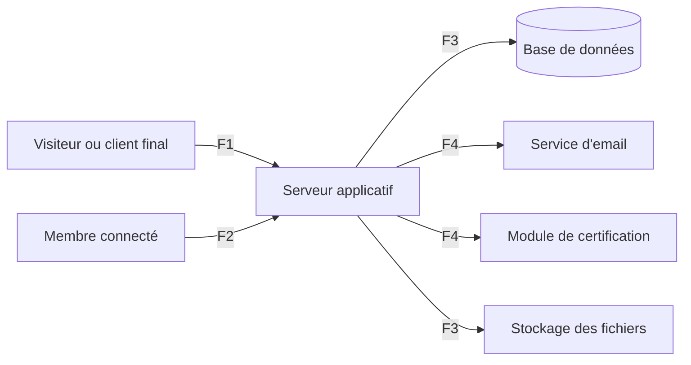

# THREATS.md — Modèle de menaces

Application de facturation pour petites structures.
Statut : **validé**. Version du 2 octobre 2026.

## Comment lire ce document

Ce document répond à quatre questions : que construit-on, qu'est-ce qui peut mal tourner, que fait-on contre, et comment le vérifie-t-on.

- Les sections 1 à 4 décrivent le terrain : ce qu'on protège, contre qui, et par où l'on peut attaquer.
- La section 5 liste les menaces, avec pour chacune sa priorité, ses parades et le test qui les vérifie.
- La section 6 fixe qui a le droit de faire quoi.
- La section 7 traite des données personnelles.
- La section 8 liste ce qu'on accepte de ne pas couvrir.

**Notation des menaces.** Gravité (G) et vraisemblance (V) vont de 1 à 3. La priorité est leur produit : **Haute** à partir de 6, **Moyenne** pour 3 ou 4, **Faible** en dessous. Les parades renvoient aux exigences de SPEC.md.

**Usage pendant le développement.** Chaque fiche de fonctionnalité cite les menaces qui la concernent. Chaque menace de priorité Haute ou Moyenne a au moins un test automatisé. Toute nouvelle fonctionnalité ajoute ses lignes ici avant d'être codée.

---

## 1. Les actifs

| # | Actif | Conséquence d'une compromission |
|---|---|---|
| A1 | Données d'une organisation : clients, devis, factures, paiements | Fuite vers un concurrent, perte de confiance de tous les utilisateurs |
| A2 | Intégrité des documents émis et des paiements | Fraude, litige avec un client ou l'administration fiscale |
| A3 | Instructions de paiement | Détournement des règlements des clients |
| A4 | Comptes et moyens d'accès | Accès à tout ce qui précède |
| A5 | Journal d'audit | Impossibilité d'établir ce qui s'est passé |
| A6 | Données personnelles des clients particuliers | Atteinte à la vie privée de personnes qui ne sont pas des utilisateurs |
| A7 | Secrets de l'application : accès à la base, clés des services | Compromission de toutes les organisations à la fois |
| A8 | Disponibilité du service | Une entreprise ne peut plus facturer |

## 2. Les attaquants

| # | Profil | Moyens | But |
|---|---|---|---|
| P1 | L'inconnu sur Internet | Scripts, essais en masse | Comptes, données à revendre |
| P2 | Le membre d'une autre organisation | Compte légitime, connaissance de l'interface | Prix et clients d'un concurrent |
| P3 | Le membre qui dépasse ses droits | Connaissance interne | Voir ou faire ce que son rôle interdit |
| P4 | Le membre malhonnête ou sur le départ | Droits réels | Détourner un paiement, emporter le fichier client |
| P5 | Le client final | Un lien valide | Voir d'autres documents, modifier le sien |
| P6 | Celui qui a volé un accès | Mot de passe ou session d'un membre | Tout ce que ce membre peut faire |

## 3. Le système et ses frontières de confiance

Une frontière de confiance est un endroit où des données passent d'une zone qu'on ne maîtrise pas à une zone qu'on maîtrise. Tout ce qui la franchit doit être contrôlé.

| Frontière | Entre quoi et quoi | Ce qui la franchit | Règle |
|---|---|---|---|
| F1 | Internet anonyme et serveur | Inscription, connexion, liens publics | Rien n'est fiable. Validation, limitation de débit, réponses uniformes |
| F2 | Navigateur d'un membre et serveur | Toutes les actions métier | L'identité est connue, mais chaque donnée et chaque droit sont revérifiés côté serveur |
| F3 | Serveur et stockage | Requêtes, fichiers | Le serveur est le seul à y accéder. La base applique en plus l'isolation par organisation |
| F4 | Serveur et services extérieurs | Emails, demandes de certification | On envoie le minimum, et on traite toute réponse comme une donnée à valider |

Le navigateur n'est **jamais** une zone de confiance : tout ce qui s'y trouve peut être lu et modifié par l'utilisateur.

## 4. Les surfaces d'attaque

| # | Surface | Accès | Cas d'utilisation |
|---|---|---|---|
| SA1 | Inscription, connexion, réinitialisation | Anonyme | UC-01 à UC-03 |
| SA2 | Lien d'invitation | Anonyme avec jeton | UC-09 |
| SA3 | Page publique d'un devis, avec réponse | Anonyme avec jeton | UC-19 |
| SA4 | Page publique d'une facture | Anonyme avec jeton | UC-24 |
| SA5 | Actions métier des membres | Connecté | UC-06 à UC-31 |
| SA6 | Téléversement du logo | Propriétaire | UC-07 |
| SA7 | Contenus saisis repris dans les pages, PDF, emails, exports | Connecté ou client final | UC-07, UC-14, UC-19, UC-28, UC-30 |
| SA8 | Envoi d'emails | Connecté | UC-08, UC-18, UC-23, UC-28 |
| SA9 | Échanges avec le module de certification | Système | UC-22, UC-25 |
| SA10 | Chaîne de développement : dépôt, dépendances, secrets, déploiement, assistant de code | Développeur | Toutes |

---

## 5. Les menaces

### 5.1 Usurpation d'identité

| # | Menace | Qui | G | V | Priorité | Parades | Test |
|---|---|---|---|---|---|---|---|
| T-01 | Trouver un mot de passe par essais en masse ou par réutilisation d'identifiants fuités | P1 | 3 | 3 | Haute | S-10, S-11, S-12 | Après N échecs, la connexion est bloquée, même avec le bon mot de passe |
| T-02 | Utiliser un mot de passe volé sur un compte Propriétaire ou Comptable | P6 | 3 | 2 | Haute | S-12, S-13 | Un rôle sensible sans second facteur n'accède à aucune donnée |
| T-03 | Voler ou rejouer une session | P6 | 3 | 2 | Haute | S-17, S-82, F-004 | Une session révoquée ou fermée est refusée |
| T-04 | Prendre un compte par la réinitialisation du mot de passe | P1 | 3 | 2 | Haute | S-11, S-15, S-17 | Un jeton expiré, déjà utilisé ou modifié est refusé. Le second facteur reste exigé |
| T-05 | Rejoindre une organisation avec une invitation interceptée | P1 | 3 | 1 | Moyenne | S-15, S-16 | Un compte portant un autre email ne peut pas accepter |
| T-06 | Deviner le code de double authentification ou réutiliser un code de secours | P6 | 3 | 1 | Moyenne | S-12 | Tentatives limitées. Un code de secours ne sert qu'une fois |
| T-07 | Découvrir quels emails ont un compte | P1 | 1 | 3 | Moyenne | S-11 | Les réponses sont identiques pour un email connu et inconnu |

### 5.2 Altération

| # | Menace | Qui | G | V | Priorité | Parades | Test |
|---|---|---|---|---|---|---|---|
| T-10 | Modifier ou supprimer une facture ou un avoir émis | P3, P4 | 3 | 2 | Haute | R-05, S-03 | Toute requête de modification d'un document émis est refusée |
| T-11 | Supprimer ou modifier un paiement après encaissement | P4 | 3 | 2 | Haute | S-31, S-70 | Aucune requête ne supprime un paiement. L'annulation est tracée |
| T-12 | Remplacer les instructions de paiement pour détourner les règlements | P4, P6 | 3 | 2 | Haute | S-14, S-33, S-70 | Refusé sans nouvelle authentification. Un email part à tous les Propriétaires |
| T-13 | Envoyer au serveur des totaux ou des prix falsifiés | P3 | 2 | 2 | Moyenne | S-50, R-02 | Le serveur ignore les totaux reçus et recalcule |
| T-14 | Dépasser le total d'une facture par des paiements ou des avoirs simultanés | P4 | 2 | 2 | Moyenne | S-30 | Deux requêtes simultanées : une seule aboutit |
| T-15 | Créer un doublon ou un trou dans la numérotation | P3 | 2 | 2 | Moyenne | R-03, S-32 | Vingt émissions simultanées donnent vingt références consécutives |
| T-16 | Modifier ou rejouer la réponse à un devis | P5 | 2 | 2 | Moyenne | S-22, R-14 | Une seconde réponse est refusée |
| T-17 | Faire agir un membre à son insu depuis un autre site | P1 | 3 | 1 | Moyenne | S-81, S-82 | Une requête modifiante venue d'une autre origine est refusée |
| T-18 | Altérer la réponse du module de certification | P1 | 3 | 1 | Moyenne | S-87 | Une réponse mal formée laisse la facture en attente |

### 5.3 Répudiation

| # | Menace | Qui | G | V | Priorité | Parades | Test |
|---|---|---|---|---|---|---|---|
| T-20 | Nier avoir émis, annulé ou exporté | P4 | 2 | 2 | Moyenne | S-70, S-71 | Chaque action sensible produit une entrée avec son auteur |
| T-21 | Effacer ou modifier ses traces dans le journal d'audit | P4 | 3 | 1 | Moyenne | S-70 | Aucun rôle ne peut modifier ou supprimer une entrée |
| T-22 | Contester l'acceptation d'un devis | P5 | 1 | 2 | Faible | F-042 | La date, l'heure et le nom saisi sont enregistrés |

### 5.4 Divulgation

| # | Menace | Qui | G | V | Priorité | Parades | Test |
|---|---|---|---|---|---|---|---|
| T-30 | Lire ou associer une ressource d'une autre organisation en changeant un identifiant | P2 | 3 | 3 | Haute | S-01, S-02, S-04 | Pour chaque route, un membre de B reçoit la réponse « introuvable » sur une ressource de A |
| T-31 | Voir des données hors de son rôle : Commercial en mode restreint, Lecteur | P3 | 2 | 3 | Haute | F-016, S-02, S-03 | Listes, recherche, tableau de bord et fiches ne révèlent rien hors périmètre |
| T-32 | Deviner des liens publics de devis ou de factures | P1, P5 | 3 | 2 | Haute | S-20, S-21, S-22 | Mille jetons au hasard n'obtiennent rien et finissent bloqués |
| T-33 | Exporter massivement le fichier client avant de partir | P4 | 2 | 3 | Haute | S-14, S-70, matrice | Le Commercial n'a pas d'export. Chaque export est tracé |
| T-34 | Exécuter du code dans le navigateur d'un membre par un contenu saisi | P2, P5 | 3 | 2 | Haute | S-51, S-80 | Un nom contenant du code s'affiche comme du texte, partout |
| T-35 | Trouver des secrets ou des données personnelles dans les journaux ou les erreurs | P1, P4 | 3 | 2 | Haute | S-54, S-85 | Une erreur provoquée ne révèle ni requête, ni chemin, ni donnée |
| T-36 | Lire toute la base par une injection | P1, P2 | 3 | 1 | Moyenne | S-50, S-86 | Aucune requête construite par concaténation dans le code |
| T-37 | Faire fuiter un lien public par l'adresse d'origine envoyée à un autre site | P1 | 2 | 1 | Faible | S-80 | Les pages publiques n'envoient pas leur adresse aux sites tiers |
| T-38 | Garder l'accès à un document par un lien ancien | P5 | 1 | 2 | Faible | S-20 | Un lien révoqué ou expiré ne donne plus rien |

### 5.5 Déni de service

| # | Menace | Qui | G | V | Priorité | Parades | Test |
|---|---|---|---|---|---|---|---|
| T-40 | Utiliser l'application pour envoyer des emails en masse | P1, P4 | 2 | 3 | Haute | S-55 | Au-delà du plafond, les envois sont refusés |
| T-41 | Épuiser les quotas gratuits par des inscriptions ou des générations de PDF en masse | P1 | 2 | 2 | Moyenne | S-11, S-84 | Les routes coûteuses sont limitées en débit |
| T-42 | Saturer le serveur par des requêtes ou des fichiers énormes | P1, P3 | 2 | 2 | Moyenne | S-53, S-84 | Une liste est toujours paginée. Un envoi trop gros est refusé |
| T-43 | Bloquer le compte d'un tiers en provoquant des échecs de connexion | P1 | 1 | 2 | Faible | S-11 | Le blocage est temporaire et limité |
| T-44 | Supprimer l'organisation depuis un compte compromis | P6 | 3 | 1 | Moyenne | S-14, R-15 | La suppression reste annulable 30 jours |

### 5.6 Élévation de privilèges

| # | Menace | Qui | G | V | Priorité | Parades | Test |
|---|---|---|---|---|---|---|---|
| T-50 | Appeler directement une action réservée à un autre rôle | P3 | 3 | 3 | Haute | S-03, matrice | Pour chaque action, chaque rôle non autorisé est refusé |
| T-51 | S'attribuer ou attribuer un rôle supérieur | P3 | 3 | 2 | Haute | S-05, S-14, S-16 | Un Comptable ne peut modifier aucun rôle, pas même le sien |
| T-52 | Agir avec d'anciens droits après un retrait ou une rétrogradation | P4 | 3 | 2 | Haute | S-17 | Un membre retiré est refusé dès la requête suivante |
| T-53 | Contourner le filtre par organisation au niveau de la base | P2 | 3 | 1 | Moyenne | S-04 | Une requête sans contexte d'organisation ne renvoie aucune ligne |
| T-54 | Rendre l'organisation ingérable en retirant le dernier Propriétaire | P4 | 2 | 1 | Faible | R-12 | Le retrait du dernier Propriétaire est refusé |
| T-55 | Contourner la chaîne de contrôles par les points d'entrée natifs du module organisation de Better Auth (`/organization/*` : changer un rôle, retirer un membre, inviter), qui appliquent leurs propres rôles, sans la matrice, sans journal ni nouvelle authentification | P3, P6 | 3 | 2 | Haute | S-03, S-14, S-70, matrice | Avant toute exposition de `/api/auth`, les points d'entrée natifs du module organisation sont fermés : chacun répond comme une adresse inexistante. Toute opération sur l'organisation et ses membres passe par la chaîne de contrôles |

### 5.7 Fichiers et documents générés

| # | Menace | Qui | G | V | Priorité | Parades | Test |
|---|---|---|---|---|---|---|---|
| T-60 | Téléverser un fichier malveillant à la place du logo | P4, P6 | 2 | 2 | Moyenne | S-53 | Un fichier dont le contenu ne correspond pas au type annoncé est refusé |
| T-61 | Injecter une formule dans un export CSV | P2, P5 | 2 | 2 | Moyenne | S-52 | Un nom commençant par `=` ressort neutralisé |
| T-62 | Injecter du contenu dans un PDF ou un email par un champ saisi | P4, P5 | 2 | 2 | Moyenne | S-51, S-87 | Les balises saisies apparaissent comme du texte |
| T-63 | Faire charger au serveur une ressource distante pendant la génération d'un PDF | P4 | 3 | 1 | Moyenne | S-87 | La génération ne fait aucune requête sortante |

### 5.8 Chaîne de développement

| # | Menace | Qui | G | V | Priorité | Parades | Test |
|---|---|---|---|---|---|---|---|
| T-70 | Publier un secret dans le dépôt | Développeur | 3 | 2 | Haute | S-83 | La détection de secrets bloque le commit et la PR |
| T-71 | Installer une dépendance vulnérable, malveillante ou inventée par l'assistant | P1 | 3 | 2 | Haute | S-88 | L'audit des dépendances échoue sur une faille connue. Toute nouvelle dépendance est validée à la main |
| T-72 | Fusionner du code généré non relu qui retire un contrôle d'accès | Développeur | 3 | 2 | Haute | NF-06, S-89 | Les tests d'attaque tournent sur chaque PR. La branche principale refuse une PR en échec |
| T-73 | Laisser l'assistant de code lire des secrets ou exécuter une commande dangereuse | Développeur | 3 | 1 | Moyenne | S-83, S-89 | Les fichiers de secrets sont interdits de lecture à l'assistant |
| T-74 | Exposer les données de production dans un déploiement de prévisualisation | Développeur | 3 | 2 | Haute | S-83 | Les prévisualisations utilisent une base distincte |
| T-75 | Perdre les données sans pouvoir les restaurer | — | 3 | 1 | Moyenne | NF-07 | Une restauration a été réalisée et documentée |

---

## 6. Matrice rôles x actions

**Lecture.** ✔ autorisé. ✖ interdit. **P\*** autorisé sur son portefeuille seulement lorsque la visibilité des Commerciaux est restreinte, sur toute l'organisation sinon. **L\*** lecture seule, avec la même limite de portefeuille.

Le Visiteur et le Client final n'ont accès à rien de ce tableau, en dehors des deux lignes « par lien ».

| Action | Propriétaire | Comptable | Commercial | Lecteur |
|---|---|---|---|---|
| **Organisation** | | | | |
| Voir la liste des membres et leur rôle | ✔ | ✔ | ✔ | ✔ |
| Modifier la fiche, les taux de TVA, les délais | ✔ | ✖ | ✖ | ✖ |
| Modifier les instructions de paiement | ✔ | ✖ | ✖ | ✖ |
| Inviter un membre, révoquer une invitation | ✔ | ✖ | ✖ | ✖ |
| Modifier un rôle, retirer un membre | ✔ | ✖ | ✖ | ✖ |
| Régler la visibilité des Commerciaux | ✔ | ✖ | ✖ | ✖ |
| Supprimer l'organisation | ✔ | ✖ | ✖ | ✖ |
| Quitter l'organisation | ✔ | ✔ | ✔ | ✔ |
| **Clients** | | | | |
| Voir les clients | ✔ | ✔ | P\* | ✔ |
| Créer, modifier, archiver un client | ✔ | ✔ | P\* | ✖ |
| Réaffecter un client | ✔ | ✖ | ✖ | ✖ |
| Anonymiser un particulier | ✔ | ✖ | ✖ | ✖ |
| **Catalogue** | | | | |
| Voir le catalogue | ✔ | ✔ | ✔ | ✔ |
| Créer, modifier, désactiver un article | ✔ | ✔ | ✖ | ✖ |
| **Devis** | | | | |
| Voir les devis | ✔ | ✔ | P\* | ✔ |
| Créer, modifier, supprimer un brouillon | ✔ | ✔ | P\* | ✖ |
| Envoyer, révoquer le lien | ✔ | ✔ | P\* | ✖ |
| Marquer accepté ou refusé | ✔ | ✔ | P\* | ✖ |
| Transformer en brouillon de facture | ✔ | ✔ | P\* | ✖ |
| **Factures et avoirs** | | | | |
| Voir les brouillons de facture | ✔ | ✔ | P\* | ✔ |
| Créer, modifier, supprimer un brouillon | ✔ | ✔ | P\* | ✖ |
| Voir les factures émises, les avoirs et les paiements | ✔ | ✔ | L\* | ✔ |
| Émettre une facture, relancer une certification | ✔ | ✔ | ✖ | ✖ |
| Envoyer une facture, révoquer le lien | ✔ | ✔ | ✖ | ✖ |
| Émettre un avoir | ✔ | ✔ | ✖ | ✖ |
| **Paiements et relances** | | | | |
| Enregistrer un paiement | ✔ | ✔ | ✖ | ✖ |
| Annuler un paiement, enregistrer un remboursement | ✔ | ✔ | ✖ | ✖ |
| Gérer les modèles de relance | ✔ | ✔ | ✖ | ✖ |
| Envoyer une relance | ✔ | ✔ | ✖ | ✖ |
| **Pilotage** | | | | |
| Voir le tableau de bord | ✔ | ✔ | P\* | ✔ |
| Exporter en CSV | ✔ | ✔ | ✖ | ✔ |
| Exporter l'ensemble des données | ✔ | ✖ | ✖ | ✖ |
| Consulter le journal d'audit | ✔ | ✖ | ✖ | ✖ |
| **Par lien, sans compte** | | | | |
| Consulter un devis et y répondre | Client final détenteur du lien | | | |
| Consulter une facture | Client final détenteur du lien | | | |

Chaque utilisateur gère en outre son propre compte : mot de passe, double authentification, sessions, suppression du compte. Le départ d'une organisation figure dans le tableau (« Quitter l'organisation ») ; la règle du dernier Propriétaire (R-12) s'y applique.

**Règle de construction.** Cette matrice est écrite une seule fois dans le code, à un seul endroit. Les contrôles d'accès et les tests la lisent tous deux. Un test parcourt chaque case et vérifie que la réponse du serveur lui correspond.

---

## 7. Données personnelles

### 7.1 Cadre

La Côte d'Ivoire dispose d'une loi sur la protection des données à caractère personnel et d'une autorité de contrôle. Le texte applicable et les obligations de déclaration sont **à vérifier** auprès de cette autorité avant toute mise en service réelle. Ce document applique les principes communs à ces législations : collecter le minimum, pour un but précis, pendant une durée limitée, en le protégeant.

L'application traite deux catégories de personnes : ses **utilisateurs**, qui ont un compte, et les **clients de ses utilisateurs**, qui n'ont rien signé avec elle. Pour ces derniers, c'est l'organisation qui décide des données saisies, et l'application agit pour son compte.

### 7.2 Inventaire

| Donnée | Personnes | Pourquoi | Durée de conservation | Suppression |
|---|---|---|---|---|
| Nom, email, mot de passe haché | Utilisateurs | Authentifier | Durée de vie du compte | À la suppression du compte |
| Secret de double authentification, codes de secours hachés | Utilisateurs | Authentifier | Durée de vie du compte | À la désactivation ou à la suppression |
| Sessions : appareil, adresse IP, dates | Utilisateurs | Sécurité, affichage des sessions | 30 jours sans activité | Automatique |
| Compte non vérifié | Visiteurs | Inscription en cours | 7 jours | Automatique |
| Invitation : email invité | Personnes invitées | Inviter | 7 jours | Automatique à l'expiration |
| Fiche client entreprise : contact, email, téléphone | Clients | Facturer | Durée de vie de l'organisation | À la suppression de l'organisation |
| Fiche client particulier : nom, téléphone, adresse, email facultatifs | Clients particuliers | Facturer | Durée de vie de l'organisation | Anonymisation sur demande |
| Coordonnées figées sur un document émis | Clients | Preuve et obligation de conservation des pièces | Durée de vie de l'organisation | Non modifiable. Suppression avec l'organisation |
| Réponse à un devis : nom saisi, date, heure | Clients | Preuve de l'accord | Durée de vie du devis | Avec le devis |
| Journal d'audit : auteur, action, date | Utilisateurs | Traçabilité | Durée de vie de l'organisation | Avec l'organisation |
| Journaux techniques | Utilisateurs | Diagnostic | 30 jours | Automatique. Sans donnée personnelle ni secret |

### 7.3 Ce que l'application ne collecte pas

Date de naissance, pièce d'identité, données bancaires des clients, géolocalisation, et aucune mesure d'audience par un service tiers.

### 7.4 Droits des personnes

- **Un utilisateur** consulte et modifie ses informations, et supprime son compte, sauf s'il est le dernier Propriétaire d'une organisation.
- **Un client particulier** s'adresse à l'organisation qui l'a facturé. Celle-ci peut corriger sa fiche ou l'anonymiser. Les documents émis ne sont pas modifiés, car leur conservation est une obligation de l'organisation.
- **Une organisation** exporte l'ensemble de ses données et peut demander sa suppression.

### 7.5 Destinataires extérieurs

Les données ne quittent l'application que vers l'hébergeur, le fournisseur de base de données, le service d'envoi d'emails et, à terme, la plateforme de certification.

| Destinataire | Rôle | Hébergement |
|---|---|---|
| Neon | Base de données | Allemagne (Francfort) |
| Vercel | Serveur applicatif | Allemagne (Francfort) pour les fonctions. Les pages statiques sont distribuées par un réseau mondial |
| GitHub | Code source, sans secret ni donnée réelle | États-Unis |
| Resend, Sentry | Non encore configurés | À relever lors de leur mise en place |

---

## 8. Risques résiduels acceptés

Ce sont les situations que les parades ne couvrent pas, et qu'on choisit d'assumer en le sachant.

| # | Risque | Pourquoi on l'accepte | Ce qui le limite |
|---|---|---|---|
| RR-1 | Un Propriétaire malhonnête peut tout faire dans son organisation | Il en est le responsable légitime | Journal d'audit non modifiable, emails aux autres Propriétaires |
| RR-2 | Un client transfère son lien à un tiers | Le lien fonctionne comme un courrier transmis | Lien limité à un document, expirable, révocable |
| RR-3 | Le poste ou la boîte email d'un membre est compromis | Hors du contrôle de l'application | Double authentification, sessions révocables |
| RR-4 | Une faille chez l'hébergeur ou le fournisseur de base | Dépendance inévitable | Choix de fournisseurs reconnus, sauvegardes, secrets renouvelables |
| RR-5 | Une attaque massive visant à saturer le service | Hors de portée d'une offre gratuite | Limitation de débit, protections de l'hébergeur |
| RR-6 | Les documents produits en mode simulateur n'ont pas de valeur fiscale | L'accès réel à la plateforme dépend de démarches externes | Mention visible sur chaque document |
| RR-7 | Un Comptable enregistre un faux paiement | Il faut bien faire confiance à celui qui saisit | Auteur tracé, aucune suppression possible |
| RR-8 | Les tables de Better Auth (`member`, `user`, `session`, `organization`, `invitation`) n'ont pas de règle d'isolation : une requête écrite avec la transaction d'une organisation peut lire les lignes d'une autre | Un utilisateur n'appartient pas à une seule organisation, et Better Auth lit et écrit ces tables hors de toute organisation active, à la connexion par exemple (`DESIGN.md` section 2.5) | Traité au jalon 2 : toute requête de l'application sur ces tables filtre explicitement sur l'organisation du contexte, et reçoit un test d'attaque qui tente de lire l'autre organisation. Aujourd'hui, une seule requête : `lireAdhesion`, filtrée sur l'organisation de la transaction et l'utilisateur de la session |

---

## 9. Exigences ajoutées par cette phase

Le modèle de menaces a fait apparaître des protections techniques absentes de SPEC.md. Elles y ont été reportées, en section 5.8.

- **S-80. En-têtes de sécurité.** L'application envoie une politique de sécurité du contenu stricte, interdit son affichage dans un cadre d'un autre site, impose HTTPS et n'envoie pas l'adresse des pages publiques aux sites tiers.
- **S-81. Requêtes venues d'un autre site.** Toute requête modifiante est refusée si elle ne provient pas de l'application elle-même.
- **S-82. Cookies de session.** Ils sont inaccessibles aux scripts, transmis uniquement en HTTPS et non envoyés lors d'une navigation venue d'un autre site.
- **S-83. Secrets.** Aucun secret dans le dépôt. Les secrets sont distincts entre développement, prévisualisation et production, et renouvelables. Les prévisualisations n'accèdent jamais aux données de production.
- **S-84. Limites de volume.** Toute liste est paginée, toute requête et tout fichier a une taille maximale, et les opérations coûteuses sont limitées en débit.
- **S-85. Erreurs.** Le client ne reçoit qu'un message générique et un identifiant d'incident. Le détail reste dans les journaux.
- **S-86. Accès aux données.** Toute requête à la base passe par la couche d'accès prévue, avec des requêtes paramétrées. Aucune requête n'est construite par concaténation.
- **S-87. Documents générés et réponses externes.** La génération d'un PDF ne charge aucune ressource distante. Toute réponse d'un service extérieur est validée par un schéma avant usage.
- **S-88. Dépendances.** Les versions sont figées. Un audit automatique s'exécute sur chaque PR. Toute nouvelle dépendance est vérifiée à la main : existence, éditeur, popularité.
- **S-89. Chaîne de développement.** La branche principale n'accepte que des PR dont les tests, l'analyse du code et la détection de secrets ont réussi. L'assistant de code n'a pas accès aux fichiers de secrets.

## 10. Points tranchés et points ouverts

1. **Validé :** le Commercial voit les factures émises, avoirs et paiements de ses clients en lecture seule (SPEC.md, F-016).
2. **Validé :** les durées de conservation de la section 7.2 (SPEC.md, S-63).
3. **Ouvert :** le cadre légal ivoirien sur les données personnelles et la durée de conservation des pièces comptables reste à vérifier auprès d'une source officielle.
